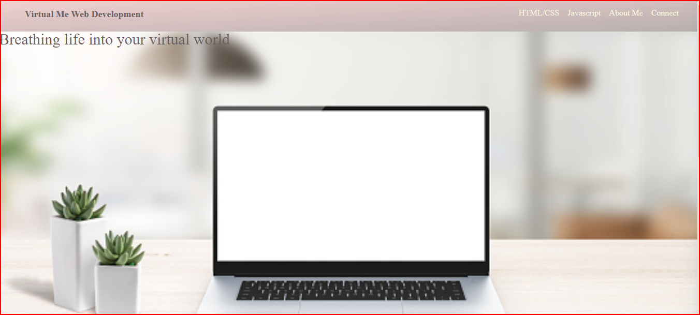

# Virtual-Me
## Description
This is my web profile that I created during my time at the Denver University Coding Boot Camp. In it you'll find a short bio of who I am, a navigation bar with links to my projects, the about me section, and my contact information. You will also find a link to my Github Profile at the bottom of the page. 

## Project URL
<https://kaleikautakaoka.github.io/Virtual-Me/>

## Deployment 
- [https://kaleikautakaoka.github.io/Virtual-Me/](https://kaleikautakaoka.github.io/Virtual-Me/)

## Demo/Screenshot

<table>
<tr>
<td>Virtual Me Page Preview</td>
</tr>
<tr>
<td></td>
</tr>
</table>

## Technologies

HTML, CSS

## License 
NA

## Resources
[w3schools](https://www.w3schools.com/)
[FlexboxFroggy](https://flexboxfroggy.com/)
[CSS-Tracks](https://css-tricks.com/)
[Youtube](https://www.youtube.com/watch?v=1Rs2ND1ryYc)
[Unsplash](https://unsplash.com/s/photos/hero-header)

## Contact
Email: sasasa@gmail.com

## Author
Author: Sachi Takaoka
GitHub: <https://github.com/kaleikautakaoka>
